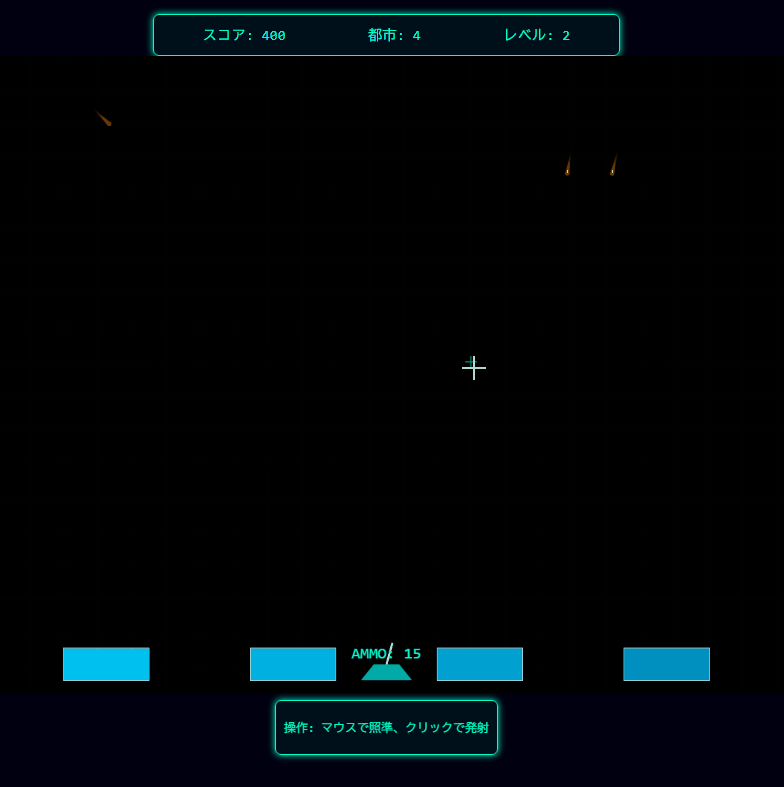

# サイバーミサイルコマンド 🚀

##   公開ページ
 [https://keigox68000.github.io/CyberMissileCommand/](https://keigox68000.github.io/CyberMissileCommand/)

## これはなに？

 空から降ってくる敵ミサイル迎撃して都市を守るシューティングゲーム 
 完全マウスオペレーション

## ルール

- マウスで照準を操作して左クリックでミサイル発射
- 自ミサイルは狙った場所で爆風を発生させて敵ミサイルを迎撃する
- 敵ミサイルを破壊した爆風で他のミサイルを誘爆することができる
- 一定数敵ミサイルを破壊することでゲームのレベルがアップして難易度が上昇する
- レベルごとに撃てる弾は15発
- 次レベルへ移行することで弾は補給される
- 4つある都市をすべて破壊されるとその時点でゲームオーバー
- 都市が破壊されている場合1500点ごとに1都市補充される

Good Luck! 👍